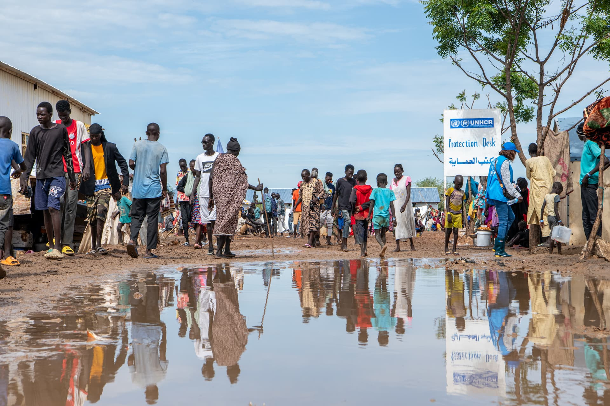

```{r setup, include=FALSE}
knitr::opts_chunk$set(echo = FALSE,
  warning = FALSE,
  message = FALSE,
  collapse = TRUE,
  comment = "#>",
  dev = "ragg_png",
  fig.width = 6.8,
  fig.asp = .618,
  fig.align = "center",
  out.width = "100%")

library(tidyverse) # data manipulation
library(unhcrthemes) # unhcr ggplot style
library(refugees) # unhcr official stats
library(rhdx) # access HDX data
library(racled) # access ACLED data
library(sf) # handle geo data
```

```{r data, include=FALSE}
  
sdn_ref <- population |> 
  filter(coo_iso == "SDN") |> 
  filter(year > max(year) - 21 & max(year)) |> 
  summarise(refugees = sum(refugees, na.rm = TRUE),
            .by = year)


sdn_demo_graph <- read_csv("../data/sdn_demo.csv") |> 
  pivot_longer(cols = Girls:Men) |> 
  rename(country = `...1`) |> 
  mutate(name = fct_rev(as_factor(name)),
         country = fct_rev(as_factor(country)))


sdn_adm1 <- pull_dataset("cod-ab-sdn") |> 
  get_resource(4) |> 
  # get_resource_layers() |> 
  read_resource(
    layer = "sdn_admbnda_adm1_cbs_nic_ssa_20200831"
  )

sdn_event_sf <- read_acled(
  country = "Sudan",
  key = Sys.getenv("ACLED_ACCESS_KEY"),
  email = Sys.getenv("ACLED_EMAIL_ADDRESS")
) |> 
  filter(year == 2025) |> 
  st_as_sf(coords = c("longitude", "latitude"), crs = 4326) |> 
  filter(event_type != "Strategic developments")

```


Lorem ipsum dolor sit amet, consectetur adipiscing elit. Sed pulvinar porta tincidunt. Etiam tincidunt mi eget pretium ullamcorper. Nunc pretium aliquet metus, ac pellentesque dui pellentesque vel. In et arcu aliquet, dapibus nunc vel, consequat metus. Quisque vel volutpat mauris, ut hendrerit quam.



::: {.col2}

Lorem ipsum dolor sit amet, consectetur adipiscing elit. Sed pulvinar porta tincidunt. Etiam tincidunt mi eget pretium ullamcorper. Nunc pretium aliquet metus, ac pellentesque dui pellentesque vel. In et arcu aliquet, dapibus nunc vel, consequat metus. Quisque vel volutpat mauris, ut hendrerit quam.

Lorem ipsum dolor sit amet, **consectetur** adipiscing elit. Sed pulvinar porta tincidunt. Etiam tincidunt mi eget pretium ullamcorper. Nunc pretium aliquet metus, ac pellentesque dui pellentesque vel. In et arcu aliquet, dapibus nunc vel, consequat metus. Quisque vel volutpat mauris, ut hendrerit quam.

In et arcu aliquet, dapibus nunc vel, consequat metus. Quisque vel volutpat mauris, ut hendrerit quam.

:::

> It is further proof that refugee movements and the broader issue of migration of populations ... is a global challenge that cannot be confined to a few countries.
>
> Filippo Grandi


Lorem ipsum dolor sit amet, **consectetur** adipiscing elit. Sed pulvinar porta tincidunt. Etiam tincidunt mi eget pretium ullamcorper. Nunc pretium aliquet metus, ac pellentesque dui pellentesque vel.

# Section title

Lorem ipsum dolor sit amet, consectetur adipiscing elit. Sed pulvinar porta tincidunt. Etiam tincidunt mi eget pretium ullamcorper. Nunc pretium aliquet metus, ac pellentesque dui pellentesque vel. In et arcu aliquet, dapibus nunc vel, consequat metus. Quisque vel volutpat mauris, ut hendrerit quam.

```{r line}
ggplot(data = sdn_ref,
       aes(x = year, y = refugees, group = 1)) +
  geom_line(color = unhcr_pal(n = 1, "pal_blue"), size = 1) +
  labs(
    title = "Evolution of refugees from Sudan",
    caption = "Source: UNHCR"
  ) +
  scale_y_continuous(
    breaks = seq(0, 1.8e6, by = 0.3e6),
    labels = scales::label_number(scale_cut = scales::cut_short_scale()),
    limits = c(0, 1.8e6)
  ) + 
  scale_x_continuous(
    breaks = seq(2004, 2024, 2)
  ) +
  theme_unhcr(
    axis_title = FALSE,
    grid = "Y"
  )
  

```

# Section title

Lorem ipsum dolor sit amet, consectetur adipiscing elit. Sed pulvinar porta tincidunt. Etiam tincidunt mi eget pretium ullamcorper. Nunc pretium aliquet metus, ac pellentesque dui pellentesque vel. In et arcu aliquet, dapibus nunc vel, consequat metus. Quisque vel volutpat mauris, ut hendrerit quam. Lorem ipsum dolor sit amet, consectetur adipiscing elit. Sed pulvinar porta tincidunt. Etiam tincidunt mi eget pretium ullamcorper. Nunc pretium aliquet metus, ac pellentesque dui pellentesque vel. In et arcu aliquet, dapibus nunc vel, consequat metus. Quisque vel volutpat mauris, ut hendrerit quam.

```{r demo, fig.asp = .5}
subtitle <- "<b style='color:#0072bc'>Girls</b> and <b style='color:#027B68'>Boys</b> refers to ages 0-17. <b style='color:#8EBEFF'>Women</b> and <b style='color:#6AE8CC'>Men</b> are 18+"

ggplot(
  data = sdn_demo_graph,
  aes(x = value, y = country, fill = name)
) +
  geom_col(width = 0.8) +
  scale_fill_unhcr_d(
    palette = "pal_unhcr", nmax = 10, order = c(6, 2, 5, 1),
    guide = guide_legend(reverse = TRUE)
  ) +
  scale_x_continuous(
    expand = expansion(c(0, .1)),
    labels = scales::label_percent()
  ) +
  labs(
    title = "Demographic breakdown of new arrivals",
    subtitle = subtitle,
    caption = "Source: UNHCR"
  ) +
  theme_unhcr(
    axis_title = FALSE,
    axis = "Y",
    grid = "X",
    legend = FALSE
  )
```

Lorem ipsum dolor sit amet, consectetur adipiscing elit. Sed pulvinar porta tincidunt. Etiam tincidunt mi eget pretium ullamcorper.

```{r map}
ggplot() +
  geom_sf(data = sdn_adm1, fill = "transparent") +
  geom_sf(data = sdn_event_sf,
          color = unhcr_pal(n = 1, name = "pal_red"),
          alpha = 0.3) +
  scale_color_unhcr_d() +
  labs(
    title = "Conflict events in 2025",
    caption = "Source: ACLED"
  ) +
  theme_unhcr(void = TRUE)
```

